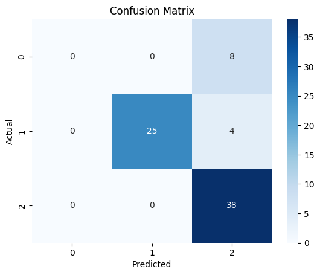
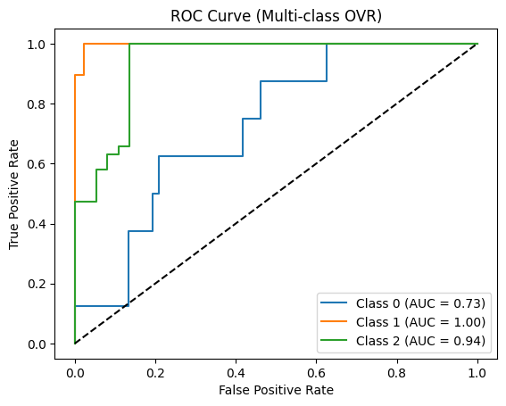

# 🧠 Dementia Classification using Support Vector Machines (SVM)

## 📌 Project Overview
This project applies **Support Vector Machines (SVM)** to classify dementia status using the **OASIS dataset**.  
The goal is to distinguish between three groups:  

| Label | Group Description |
|-------|-----------------|
| 0     | Converted (patients who transitioned from nondemented to demented) |
| 1     | Demented |
| 2     | Nondemented |

The model is evaluated using **Confusion Matrix** and **ROC-AUC curves** to assess classification performance.

---

## 📊 Dataset
**Source:** [OASIS – Open Access Series of Imaging Studies](https://datasetsearch.research.google.com/search?src=0&query=svm&docid=L2cvMTFqbnltNjduMQ%3D%3D)  

**Features Used:**  
- Age  
- Education (EDUC)  
- Socioeconomic Status (SES)  
- MMSE (Mini-Mental State Examination)  
- CDR (Clinical Dementia Rating)  
- eTIV (Estimated Total Intracranial Volume)  
- nWBV (Normalized Whole Brain Volume)  
- ASF (Atlas Scaling Factor)  

**Target Variable:** `Group` (Converted, Demented, Nondemented)

---

## ⚙️ Methodology

### 1. Data Preprocessing
- Handled missing values  
- Encoded categorical variables  
- Normalized numerical features  

### 2. Model Training
- **Algorithm:** Support Vector Machine (SVM) with RBF kernel  
- **Multiclass Strategy:** One-vs-Rest (OVR)  

### 3. Evaluation Metrics
- Confusion Matrix  
- ROC Curve & AUC  
- Accuracy, Precision, Recall, F1-score  

---

## ✅ Results Summary

- **Overall Accuracy:** ~84%  

**AUC Scores:**  
- Converted (0): 0.73  
- Demented (1): 1.00  
- Nondemented (2): 0.94  

**Strengths:** High performance for Demented and Nondemented groups.  
**Weakness:** Converted patients were sometimes misclassified due to overlap with Nondemented.

---

## 📈 Visualizations
**Confusion Matrix:**  
  

**ROC Curves:**  

---

## 📌 References
- [OASIS Dataset](https://datasetsearch.research.google.com/search?src=0&query=svm&docid=L2cvMTFqbnltNjduMQ%3D%3D)  
- SVM Documentation: [scikit-learn SVM](https://scikit-learn.org/stable/modules/svm.html)
